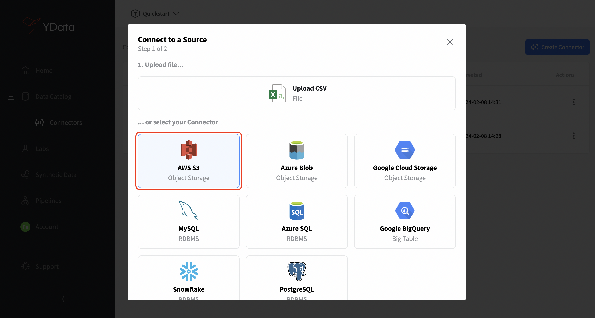
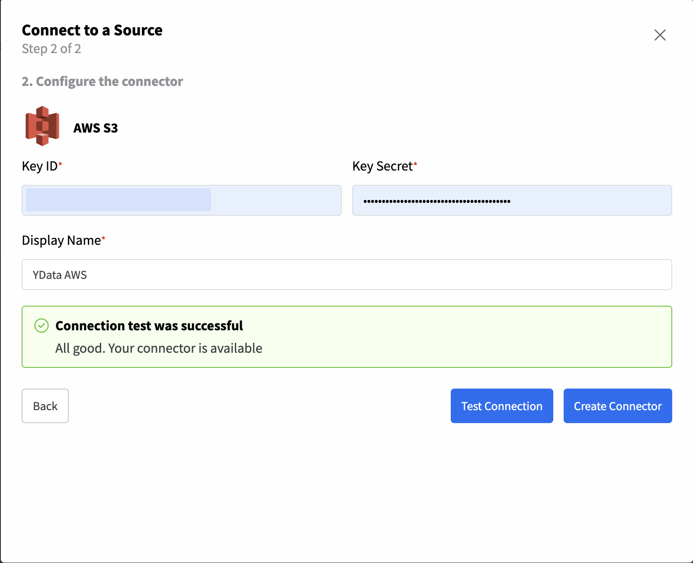

# How to create a connector in Fabric's Data Catalog?

:fontawesome-brands-youtube:{ .youtube } <a href="https://youtube.com/clip/UgkxVTrEn2jY8GL-wqSXX3PByuUH5Q81Usih?si=xdpQ4eTCo_SEcvxp"><u>How to create a connector to an RDBMS in Fabric?</u></a> 

To create a connector in YData Fabric, select the "Connectors" page from the left side menu, as illustrated in the image below.

{: style="width:75%"}

Click in *"Add Connector"* and a list of connector types to choose from will be shown to you. 

{: style="width:75%"}

For the purpose of this example we will be creating a connector to our AWS S3 storage. 
The credentials/secrets to your storage will be requested. After adding them, you can *"Test connection"* 
to ensure that all the details are correct. 
A confirmation message, similar to the one shown in the image below, should appear in our screen, 
letting you know that you can now save your connector successfully! 

 {: style="width:50%"} 

**Congrats!** 🚀 You have now created your first **Connector**! You can now create different *Datasources*
in your project's Data Catalog.
Get ready for your journey of improved quality data for AI.

