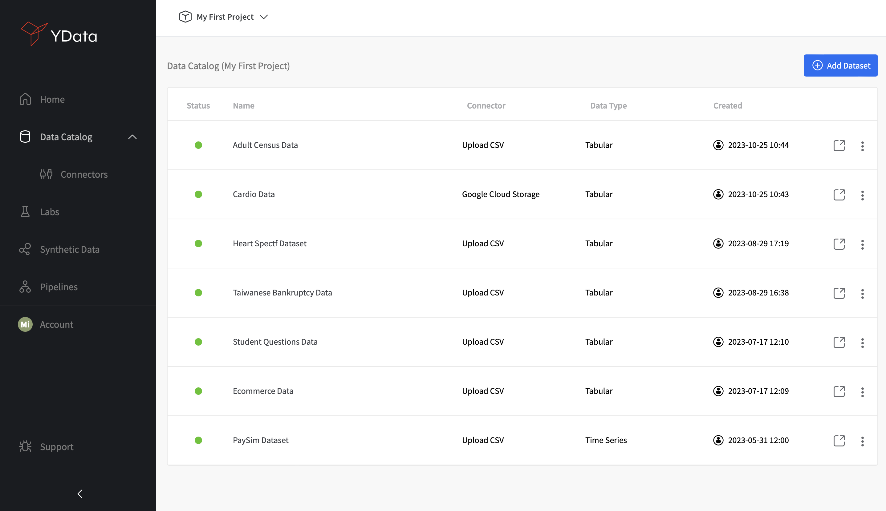

The Data Catalog can be described as a combination of 2 main elements: **Connectors** and **Datasets**.

## What are Connectors?
To ensure that large volumes of data can be processed through the entire data pipeline, Fabric is equipped with integrated **Connectors** for various types of storage -- including relational database management systems (RDBMS), data warehouses, remote object storages and even local files -- guaranteeing the data never leaves your premises.

<figure markdown>
{: style="height:500px;width:600px"}
</figure>

Fabric's Connectors run on top of Dask, leveraging the cloud computation power of a Kubernetes architecture for on-demand scalability. This way, we are able to ensure that Data Science teams can **move from small workloads on a local machine to an architecture that distributes computing** across thousands of workers with minimal changes to their workflows.

The Connectors offer:

- **Simplified** authentication;
- **Scalability** and **high-throughput**, through the combination of a distributed computing engine with an infrastructure which scales on-demand;
- **Security**, as the connection is direct and data is never moved from the original premises (only read into memory and discarded when no longer necessary).

## What are Datasets?
Using a **Connector**, it is possible to connect to specific **Datasets**, yielding a **Data Catalog**. Currently, Fabric supports **tabular**, **time series (including transactional data)** in a variety of file formats and in **multi-table RDBMS** settings.

**Datasets** are a reference to data existing in different sources (filesystems, RDBMS, etc.). They hold the metadata information (such as variable types) as well as an extensive and comprehensive data quality profiling for a general understanding of the data.

The list of available **Datasets and Connectors** is accessible via the **Data Catalog**, on the sidebar. The status of the connection to the data is periodically checked and clicking on a Dataset will open its details page.

<figure markdown>
{: style="height:550px;width:1000px"}
</figure>

???+ question "In a Lab environment and using YData’s Python SDK?"
    Fear not, all the connectors and datasets are available both through the UI and code, through the **Labs**:

    - Use the same [**Connectors**](https://github.com/ydataai/academy/tree/master/2%20-%20connectors) to connect to data, yielding a [**Dataset**](https://github.com/ydataai/academy/tree/master/3%20-%20dataset-metadata)
    - Use a [**Dataset and its Metadata**](https://github.com/ydataai/academy/tree/master/3%20-%20dataset-metadata) to:
        - View the main properties of a dataset
        - View potential data quality warnings
        - Automatically detecte sensitive attributes (such as e-mail, VAT number, credit card number, IBAN, among others)
        - Validate arbitrary business logic via **Constraints**
