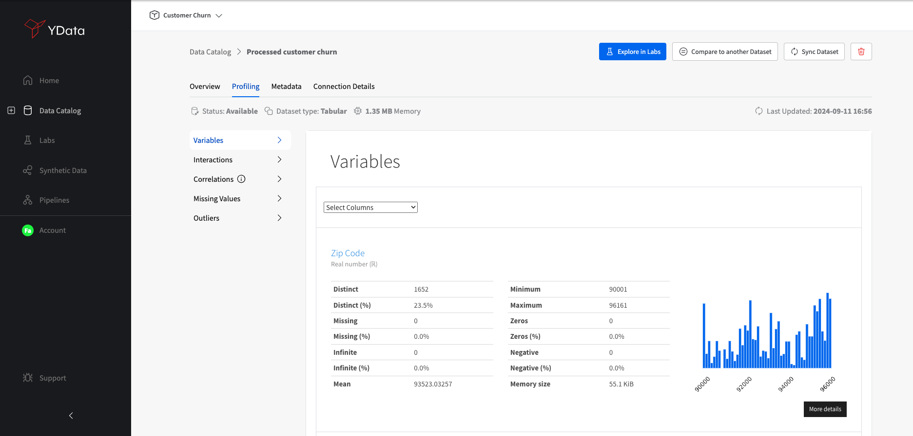
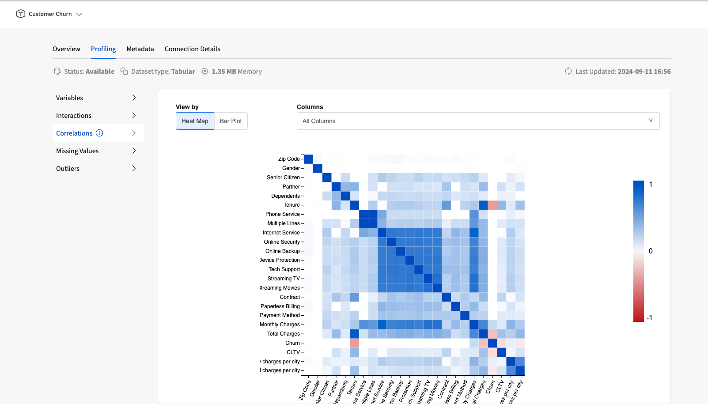
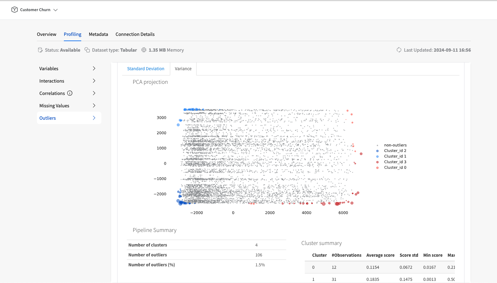

# Profiling

<figure markdown>
   {width="700"}
   <figcaption>Profiling sections</figcaption>
</figure>

## Data Structures supported

The profiling offers comprehensive insights into various types of data, including tabular, time-series text and image data.

- **Tabular data:** when dealing with tabular data, such as spreadsheets or databases, the profiling provides valuable statistics on data distribution, central tendencies, and categorical variable frequencies.
It identifies multivariate relations such as correlations and interactions in a visual manner. It also identifies missing data.
- **Time-series data:** when dealing with data with temporal dimensions, the profiling extends its capabilities to capture trends, seasonality, cyclic patterns and missing data gaps.
It can reveal information about data volatility, periodicity, and anomalies, facilitating a deeper understanding of time-dependent trends.
- **Text:**  when it comes to text data, such as strings or documents, the profiling offers insightful statistics on the distribution of word frequencies, common phrases, and unique words.

## Data types
Types, are a powerful abstraction for effective data analysis, allowing analysis under higher level lenses.
Fabric Profiling is backed by a powerful type system developed specifically for data analysis that allows an automated detection for different data types.
Currently, the following types are recognized:

- Numerical
- Categorical
- Date (and Datetime)
- String
- Time-series
- LongText

## Univariate profiling

This section provides a comprehensive overview of individual variables within a given dataset, this feature is particularly useful for exploratory data analysis (EDA)
as it automatically calculated detailed statistics, visualizations, and insights for each variable in the dataset. It offers information such as data type, missing values, unique values, basic descriptive statistics
, histogram plots, and distribution plots. This allows data analysts and scientists to quickly understand the characteristics of each variable, identify potential data quality issues, and gain initial insights into the data's distribution and variability.

## Multivariate profiling

This section provides essentials insights into the relationships between variables through correlations matrices and interactions.
The correlation view computes and presents correlation coefficients between pairs of numerical variables, helping to identify potential linear relationships.
This assists data analysts and scientists in understanding how variables change together and highlights possible multi collinearity issues.

On the other hand, the interactions section goes beyond correlation by exploring potential nonlinear relationships and interactions between variables, providing a more comprehensive understanding of how variables interact with one another.
This can be crucial in identifying hidden patterns that might not be captured through traditional correlation analysis.

### Correlations

<figure markdown>
   {width="700"}
   <figcaption>Correlations section</figcaption>
</figure>

Fabric's intuitive correlation matrix and heatmap visualizations empower users to drill down into specific variable interactions and understand
their dependencies. Additionally, Fabric’s real-time interactivity allows users to adjust filters and refine their analysis dynamically, supporting deeper insights into correlations across complex datasets.

Fabric Correlations are calculated pairwise and depending on the type schema:
- numerical to numerical variable: Spearman correlation coefficient
- categorical to categorical variable: Cramer's V association coefficient
- numerical to categorical: Cramer's V association coefficient with the numerical variable discretized automatically

### Interactions

<figure markdown>
   {width="700"}
   <figcaption>Correlations section</figcaption>
</figure>

The interactions plot visually represents how two variables influence each other across different sections of the data.
It goes beyond simple correlations by providing an interactive view of how one variable changes in relation to another.
This plot helps users detect non-linear relationships and complex patterns, allowing for deeper insights during Exploratory Data Analysis (EDA).
By dynamically highlighting these variable pair interactions, the interactions profile enables users to refine their understanding of data relationships,
guiding more informed decisions in the data preparation process.

## Missing data

This section offers valuable insights into the presence and distribution of missing data within a dataset. It can be particularly helpful for data preprocessing and quality assesment as
provides a comprehensive summary of missing values across variables, indicating the percentage of missing data for each variable. Additionally, it displays a visual representation of missing data patterns through bar plots and heatmaps,
allowing users to quickly identify which variables have the most significant amount of missing information.

## Outliers **

<figure markdown>
   {width="700"}
   <figcaption>Profiling sections</figcaption>
</figure>

This section provides a comprehensive profiling over the potential dataset outliers. You can validate and observe outliers presence and deviation from the general distribution of numerical variables
based on observed variance.
The identification of outliers allows the data analyst or scientist to assess whether they are genuine data anomalies or erroneous entries, allowing for informed decisions on whether to retain, transform, or exclude these points in further analyses.
