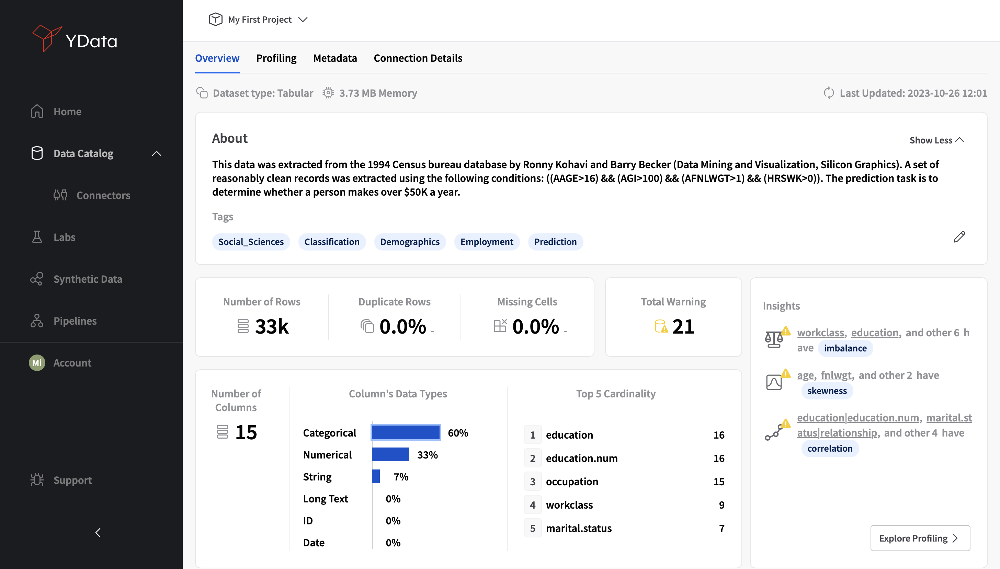
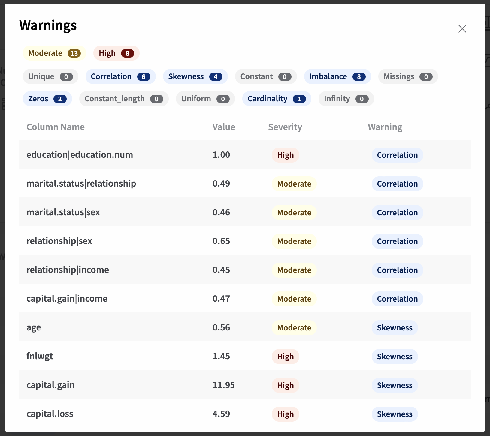
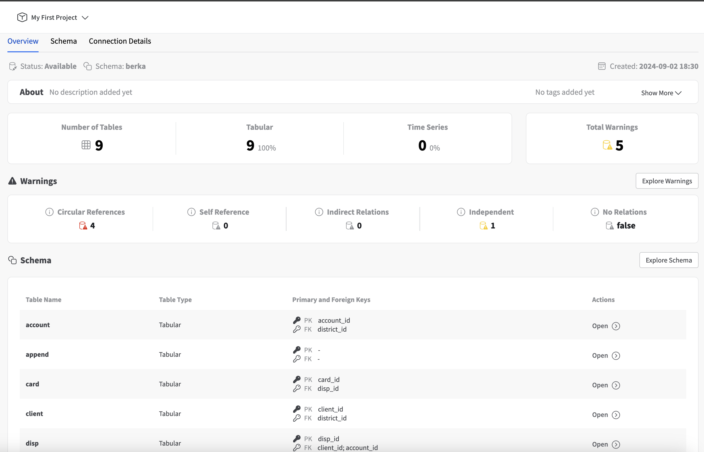

The first technical step in any data science project is to examine the data and understand its quality, value and fitness for purpose. For this reason,  Fabric’s Data Catalog includes an **Overview and Warnings** module  for a better understanding of the available datasets.

## Datasets

### Overview
When clicking on a **Dataset** available from the **Data Catalog**, it will show its details page, revealing an **Overview and Warnings** section.

<figure markdown>
{: style="height:550px;width:1200px"}
</figure>

In the **Overview**, you’ll get an overall perspective of your dataset’s characteristics, where descriptive statistics will be presented, including:

- Basic description and tags/concepts associated to the dataset
- Memory consumption
- Number of rows
- Duplicate rows (percentage / number of records)
- Number of columns
- Total data types (numeric, categorical, string, long text, ID, date)
- Missing data (percentage / number of cells)
- Main data quality warnings

### Data Quality Warnings
To enable data-centric development, Fabric **automatically detects and signals potential data quality warnings**. Warnings highlight certain peculiarities of data that might require further investigation prior to model development and deployment. However, *the validity of each issued warning and whether follow-up mitigation work is needed will depend on the specific use case and on domain knowledge*.

<figure markdown>
{: style="height:300px;width:1000px"}
</figure>

Fabric currently supports the following warnings:

- **Constant:** the column presents the same value for all observations
- **Zeros:**  the column presents the value “0” for several observations
- **Unique:** the column contains only unique/distinct values
- **Cardinality:** the columns (categorical) has a large number of distinct values
- **Infinity:** the column presents infinite ($\inf$) values
- **Constant_length**: the column (text) has constant length
- **Correlation:** the columns is highly correlated with other(s)
- **Skeweness**: the column distribution (numerical) is skewed
- **Missings:** the column presents several missing values
- **Non-stationarity:** the column (time series) presents statistical properties that change through time
- **Seasonal:** the column (time series) exhibits a seasonal pattern
- **Uniform:** the column (numerical) follows a uniform distribution
- **Imbalance:** the column (categorical) presents a high imbalance ratio between existing categories

Fabric further enables the **interactive exploration of warnings**, filtering over specific warnings and severity types (i.e., **Moderate** and **High**):

<figure markdown>
{: style="height:630px;width:700px"}
</figure>

## Databases

When users create a database in **YData Fabric's Data Catalog**, they gain access to a powerful suite of tools designed to help them manage and understand
the structure of their data. The **Data Catalog** provides a comprehensive view of each database, offering detailed insights into the schema and data quality. 
Here are the key features users can expect:

### Schema Overview with Database-Specific Warnings

As soon as a database is added to the **Fabric Data Catalog**, users are presented with a complete overview of the schema. 
This includes a visual representation of the tables, columns, and relationships that exist within the database. In addition to the schema visualization, 
Fabric automatically scans the database for potential issues and displays database-specific warnings.

<figure markdown>
{: style="height:550px;width:700px"}
</figure>

These warnings help users identify problems that could impact data integrity, such as:

- **Self-references** (columns that act as both primary and foreign keys)
  - Self-referencing columns, where a column serves as both a primary key and a foreign key in the same table, can create complexities for synthetic data generation.
  YData Fabric detects self-references and warns users when this relationship might lead to synthetic data inconsistency or improper referential integrity. 
  The platform suggests creating a temporary schema or breaking these references into a more manageable structure to ensure clarity and accuracy in data generation.
- **Independent tables** (tables with no defined relations)
  - Tables without relationships to other tables—referred to as independent tables—can result in isolated synthetic data that lacks the interdependencies
  present in the original data. YData Fabric flags such tables to alert users that these isolated data structures may need further inspection or modeling
  to ensure they align with the overall data environment.
- **Schemas with no defined relations** (schemas missing foreign key constraints)
  - When a schema lacks defined relationships between tables, YData Fabric issues warnings to alert users of the absence of foreign key constraints or 
  other relational ties. This warning is critical, as generating synthetic data without considering relationships can lead to inaccurate and fragmented datasets.
  Users are encouraged to define necessary relations or clarify dependencies to improve the quality of the synthetic data output.
- **Circular references** (tables involved in a loop of dependencies)
  - Circular references occur when tables are interdependent in a closed loop (e.g., Table A references Table B, and Table B references Table A). These can cause
  significant complications during synthetic data generation, especially in maintaining referential integrity across the cycle. 
  YData Fabric detects these loops and provides guidance on how to restructure the schema, such as breaking the cycle or temporarily isolating the tables,
  to avoid generating erroneous data.
- **Indirect relations between tables** (complex chains of relationships)
  - YData Fabric also identifies indirect relationships between tables—where two or more tables are connected via intermediary tables or columns. 
  These complex relationships can introduce nuances that might not be immediately obvious during data modeling. The platform issues warnings to ensure that 
  indirect relationships are clearly understood and accurately represented in synthetic data generation, preventing the loss of valuable data linkages.

This automatic detection ensures that users can proactively address any schema complexities before they negatively impact data queries or synthetic data generation.

### Table-Level Navigation with Detailed Warnings
Similarly to datasets that are constituted by a single table, for each database table YData Fabric provides users with the ability to navigate through each table within the database individually.
For every table, users can view a detailed overview that includes:

- Column names and types,
- Statistical overview
- Warnings (see the previous section for more details)
