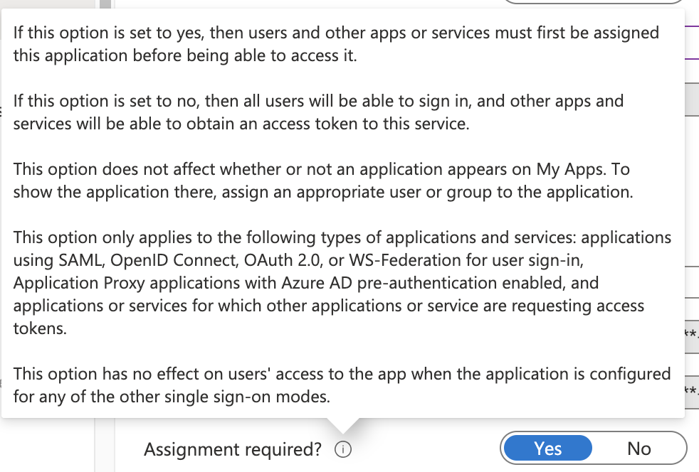
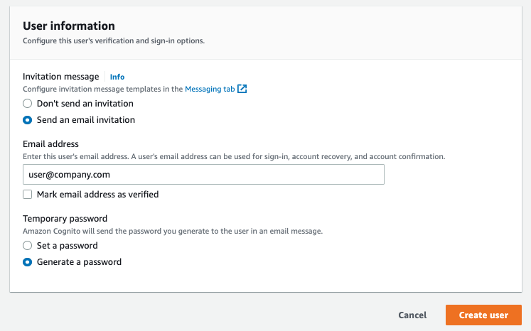
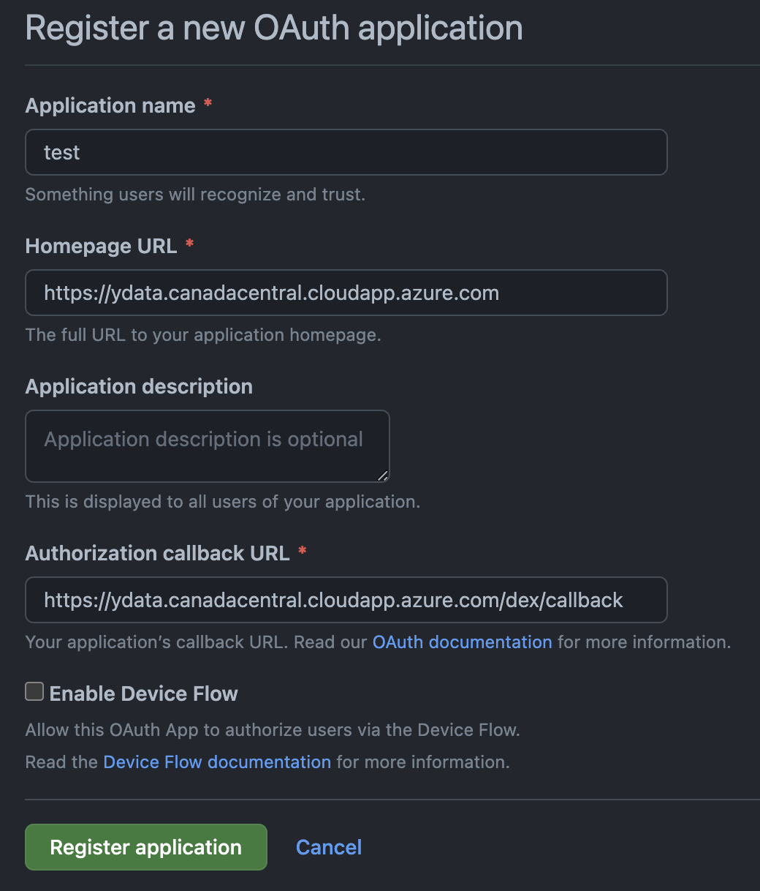
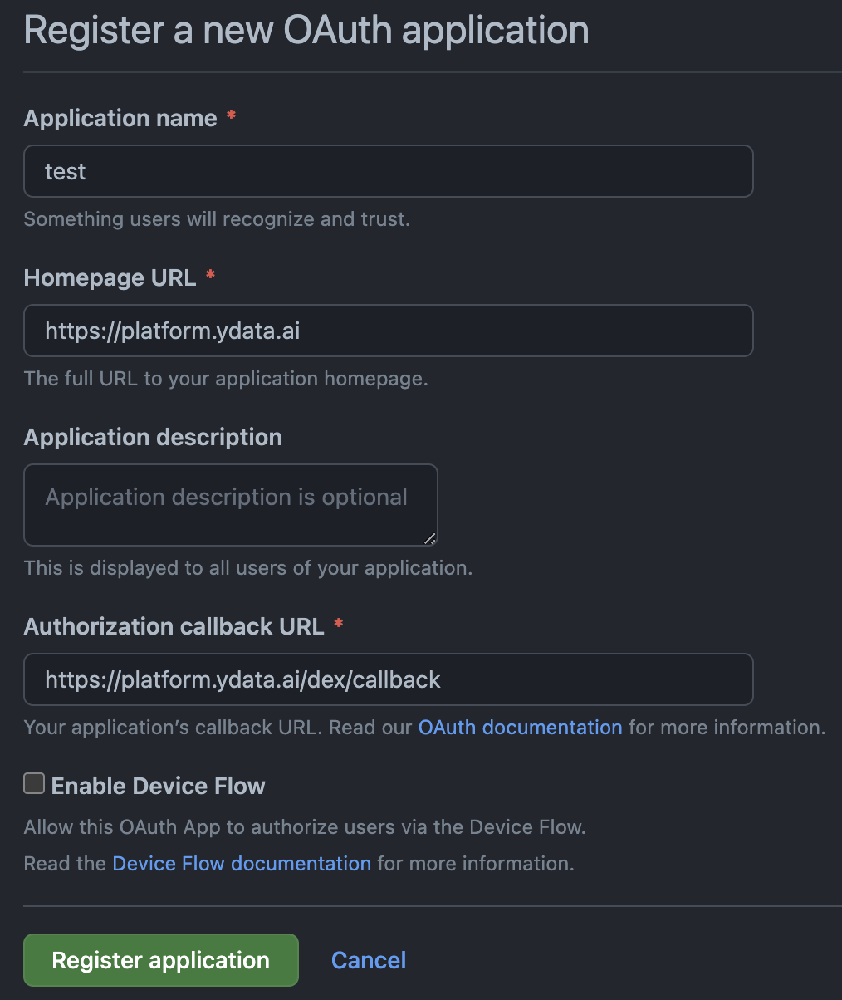

# Login Providers

**YData Fabric** offers a flexible and secure authentication system, allowing users to log in using a
variety of trusted identity providers. This technical documentation provides a comprehensive guide to
configuring and managing login providers for **YData Fabric**, including Google, Microsoft, and Amazon Cognito.
By leveraging these providers, users can benefit from seamless and secure access to **YData Fabric**, ensuring a smooth and efficient user experience.

## Google
1. Open the ^^[Google Cloud Console](https://console.cloud.google.com/)^^.
2. At the top-left, click **Menu**>**APIs & Services**>**Credentials**.
3. Click **Create Credentials**>**OAuth client ID**.
4. Click **Application type**>**Web application**.
5. In the "Name" field, type a name for the credential. This name is only shown in the Cloud Console.
6. Leave the “**Authorized JavaScript origins”** empty**.**
    Add a new “**Authorized redirect URIs**” with the platform endpoint with a suffix `*/dex/callback*`
    For the provided example:

    === "If you are using the **DNS Public Endpoint**"

        {: style="width:40%"}

    === "Or, if you are using the **DNS  Custom Domain**"

        {: style="width:40%"}

7. Click “Create”
8. Save the following credentials:
    - a. Client ID

        The Client ID for the Web Application
    - b. Client Secret

        The Client Secret for the Web Application
    - c. APP Hosted domain

        `Google supports whitelisting allowed domains when using G Suite`
        For example, for one company with the emails like person@example.com, the APP Hosted domain is example.com

9. Use the credentials as inputs for **YData Fabric**.

You can find more details in ^^[Google's official documentation](https://developers.google.com/workspace/guides/create-credentials#oauth-client-id)^^.

## Microsoft
1. Open the ^^[Azure Portal](https://portal.azure.com/)^^
2. Go to “Entra ID”
3. Click “App registrations”
4. Click “New registration”
5. Choose a name
6. For the supported account types, choose the most appropriated choice for you.
7. For the Redirect URI, choose “Web”, and fill with the platform endpoint with a suffix `*/dex/callback*`.
For the provided example:

    === "If you are using the **DNS Public Endpoint**"

        {: style="width:40%"}

    === "Or, if you are using the **DNS  Custom Domain**"

        {: style="width:40%"}

8. Click “Register”
9. Go to “Certificates & Secrets”, generate a new secret and save the value **(not the secret id)**. Please choose a large expiration date. This value cannot be changed after the installation of the platform.
10. Go to “Overview” and save the following credentials:
    - a. Client ID

        The Application (client) ID

    - b. Client Secret

        The secret generated in step 9 **(not the secret id)**.

    - c. Tenant ID

        The Directory (tenant) ID

11. Use the credentials as inputs for **YData Fabric**.

### Consent workflow
The admin consent workflow is necessary to configure, so you can access the platform using the app registered above.

1. Open the ^^[Azure Portal](https://portal.azure.com/)^^
2. Go to “Azure Active Directory”
3. Click "Enterprise applications”
4. Open the “Consent and permissions” page → “User consent settings”
5. Check with the AD administrator if an administrator is required to login to the app, or if all users can consent for the apps.
{: style="width:75%"}

### Give access only to a set of users and/or groups
1. In order to give access only to a set of users or groups, open your app and click the link “Managed application in local directory” on the right side:
{: style="width:100%"}
2. Then, click in “Properties” and enable the **“Assignment required”**
{: style="width:50%"}
3. To add users and/or groups, go to *“Users and Groups”* and click *“Add user/group”*.

With the above steps, only the users and groups listed here can access YData Fabric. For more information check Microsoft's official documentation
for ^^[Microsoft identy platform](https://learn.microsoft.com/en-us/entra/identity-platform/quickstart-register-app)^^ and
^^[Microsoft Entra](https://learn.microsoft.com/en-us/entra/identity/enterprise-apps/configure-admin-consent-workflow)^^.

## AWS Cognito
1. Go to the ^^[Amazon Cognito console](https://console.aws.amazon.com/cognito/home)^^. If prompted, enter your *AWS credentials*.
2. Choose **User Pools**. Create a new *User Pool*.
3. For the *“Configure security requirements”*, *“Configure sign-up experience”* and *“Configure message delivery”* tabs are up to your choices
or leave as the default.
4. In the “**Integrate your app**” please set the attributes as the following:
    1. “**User Pool Name**” - a name of your choice
    2. Tick the “**Use the Cognito Hosted UI**” check box.
    3. “**Domain type**”, you can use a cognito or a custom domain.
    4. “**Initial app client**” choose “**Public client**” and set a “**App client name**”
    5. For “**Client secret**”, choose “**Generate a client secret**”
    6. In the “**Allowed callback URLs**”, set your callback URL with the platform endpoint with a suffix `*/dex/callback*`
        For the provided example:
    === "If you are using the **DNS Public Endpoint**"

        {: style="width:60%"}

    === "Or, if you are using the **DNS Custom Domain**"

        {: style="width:60%"}

    7. In the “**Advanced app client settings**” →  “**Authentication flows**” step, choose “**ALLOW_USER_PASSWORD_AUTH**”
    8. For the “**OpenID Connect scopes**” choose: “Email”, “OpenID” and “Profile”.
5. Review your settings, and **“Create User Pool”.**
6. Click your new user pool, go to the “**App integration**” tab and “**App clients and analytics”.**
7. Copy and save the **Client ID** and **Client secret**.
8. For the “**Issuer URL**”, get your URL by going to https://cognito-idp.[region].amazonaws.com/[user_pool_id]/.well-known/openid-configuration
And copy and save the *"issuer* URL.
9. Use these credentials as inputs for *YData Fabric*.

### Adding new users
1. Go to the Cognito service.
2. Click the YData platform Cognito user pool.
3. Go to the Users tab
4. Click **Create user**
5. Create the users:
{: style="width:60%"}
6. The user will receive an e-mail with the temporary credentials.

For more information check ^^[Amazon's Cognito official documentation on user pools](https://docs.aws.amazon.com/cognito/latest/developerguide/getting-started-user-pools.html)^
and ^^[user pool app client](https://docs.aws.amazon.com/cognito/latest/developerguide/user-pool-settings-client-apps.html)^^.

## Github
1. Go to the ^^[GitHub OAuth Application](https://github.com/settings/applications/new)^^ page. If prompted, enter your GitHub credentials.
2. For the “**Application Name**”, choose anything.
3. For the “**Homepage URL**” and “**Authorization callback URL**”, fill with the platform endpoint and  platform endpoint with a suffix
`*/dex/callback`* correspondingly*.*
For the provided example:
=== "If you are using the **DNS Public Endpoint**"

    {: style="width:40%"}

=== "Or, if you are using the **DNS Custom Domain**"

    {: style="width:40%"}
4. Open your new APP and generate a new secret
5. Save the **Client ID** and **Client secret**
6. For the org, use your GitHub organization name.

Finally, use these credentials as inputs for to login **YData Fabric**.
For more information check ^^[GitHub's official login documentation](https://docs.github.com/en/apps/oauth-apps/building-oauth-apps/creating-an-oauth-app)^^.
