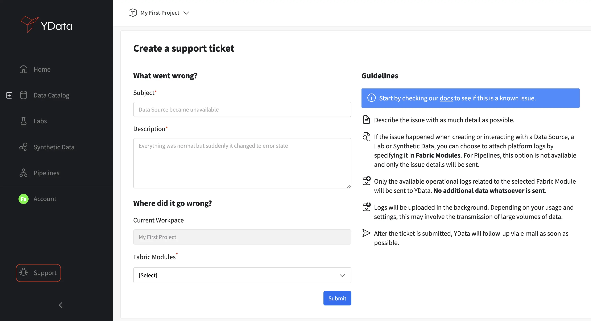

# Support

The YData Fabric support ticketing mechanism is designed to ensure that our users receive timely and efficient assistance
for any issues they encounter while using our platform. This guide provides an in-depth overview of how the support ticketing
system works, including how to submit a ticket and communicate with our support team.

## Submitting a Support Ticket

While logged into your YData Fabric instance, navigate to the **Support** section from the main dashboard, 
as shown in the image below.

{: style="width:75%"}

To create a new ticket, make sure to fill in the following fields:

- **Subject**: The subject summary of your problem
- **Description**: The detailed description of your issue. Please make sure to be thorough in your description, as it will
help the team to provide you with better support. If you can describe the steps that you've made until you've found and
issue or the blocker that you are asking support for. 
- **Fabric Modules**: Optionally, but highly recommend. If the issue happened while creating or interacting with the *Data Catalog*,
*Labs* or *Synthetic Data* generation module, users can attach the operational logs (which the platform collects).
The logs are fully operational and relate only to the selected component. Include no user data whatsoever (for instance, datasets are never sent).
The files are uploaded in the background to a location accessible by YData’s support team (private Amazon S3 Storage bucket in eu-west-1 region).

Considerably increase the ability of YData’s support team to offer timely and effective support.
After receiving the ticket (and any attached logs), YData’s support team will diagnose the issue and follow-up via e-mail as soon as possible. 
E-mail is used as the default communication channel from that moment onwards.

