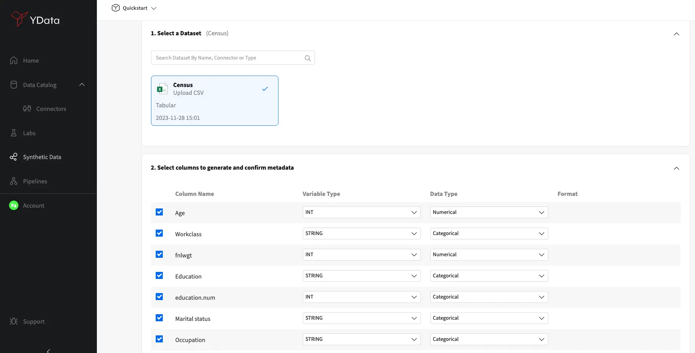
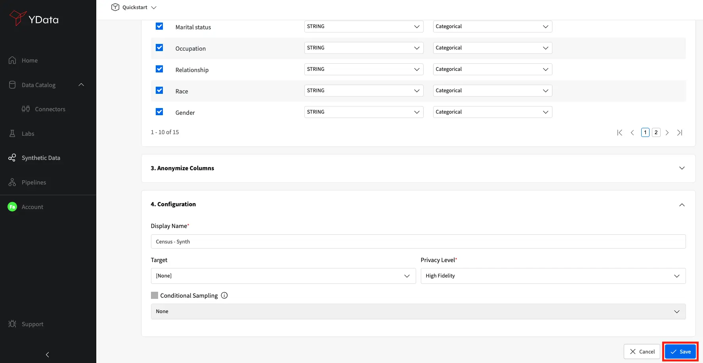
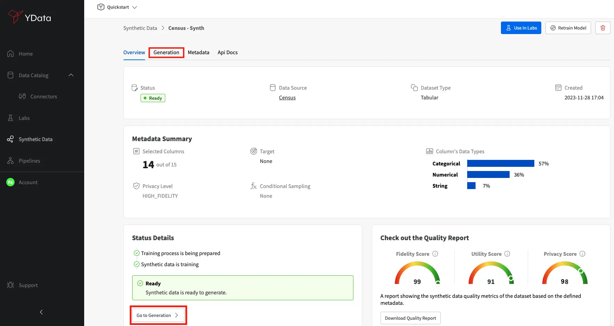
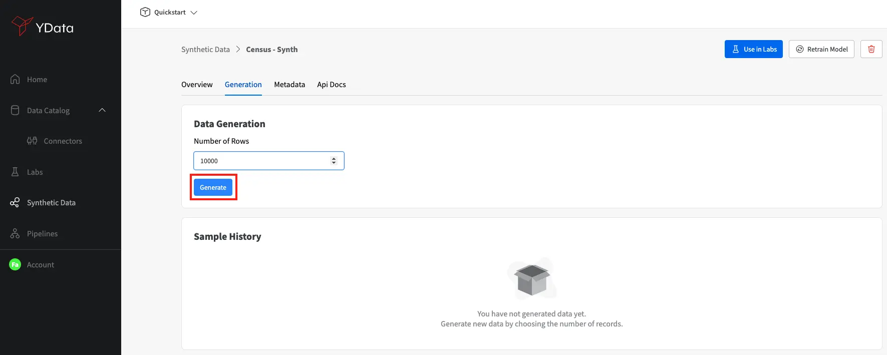
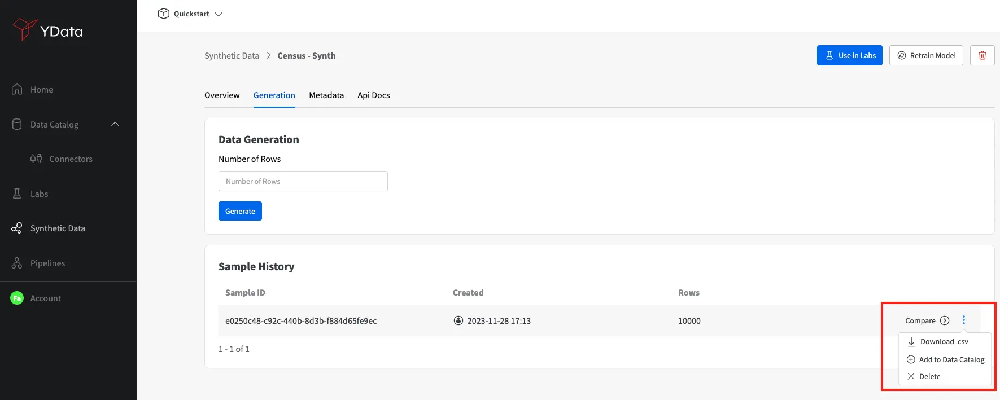

# How to create your first Synthetic Data generator

:fontawesome-brands-youtube:{ .youtube }
Check this quickstart video on <a href="https://youtu.be/GsfggG9PhgE?si=ixlCaesd3cLFOCZm"><u>how to create your first Synthetic Data generator</u></a>.

To generate your first synthetic data, you need to have a Dataset already available in your Data Catalog.
Check this tutorial to see how you can <a href="../upload_csv"><u>add your first dataset to Fabric’s Data Catalog</u></a>.

With your first dataset created, you are now able to start the creation of your Synthetic Data generator. You can either
select **"Synthetic Data"** from your left side menu, or you can select **"Create Synthetic Data"** in your project Home
as shown in the image below.

{: style="width:75%"}

You'll be asked to select the dataset you wish to generate synthetic data from and verify the columns you'd like to
include in the synthesis process, validating their *Variable* and *Data Types*.

!!! Tip "Data types are relevant for synthetic data quality"
    Data Types are important to be revisited and aligned with the objectives for the synthetic data as they can highly impact the quality
    of the generated data. For example, let's say we have a column that is a "Name", while is some situations it would make sense
    to consider it a String, under the light of a dataset where "Name" refers to the name of the product purchases, it might be more
    beneficial to set it as a Category.

{: style="width:75%"}

Finally, as the last step of our process it comes the **Synthetic Data** specific configurations, for this particular case we
only need to define a *Display Name,* and we can finish the process by clicking in the **"Save"** button as per the image below.

{: style="width:75%"}

Your **Synthetic Data** generator is now training and listed under **"Synthetic Data"**. While the model is being trained, the *Status* will be
🟡, as soon as the training is completed successfully it will transition to 🟢 as per the image below.

{: style="width:75%"}

Once the Synthetic Data generator has finished training, you're ready to start generating your first synthetic dataset.
You can start by exploring an overview of the model configurations and even download a PDF report with a comprehensive overview of your
Synthetic Data Quality Metrics. Next, you can generate synthetic data samples by accessing the *Generation* tab or click on *"Go to Generation"*.

{: style="width:75%"}

In this section, you are able to generate as many synthetic samples as you want.
For that you need to define the number rows to generate and click *"Generate"*, as depicted in the image below.

{: style="width:75%"}

A new line in your *"Sample History"* will be shown and as soon as the sample generation is completed you will be able to
*"Compare"* your synthetic data with the original data, add as a Dataset with *"Add to Data Catalog"* and last but not the least
download it as a file with *"Download csv"*.

{: style="width:75%"}

**Congrats!** 🚀 You have now successfully created your first **Synthetic Data** generator with Fabric.
Get ready for your journey of improved quality data for AI.
