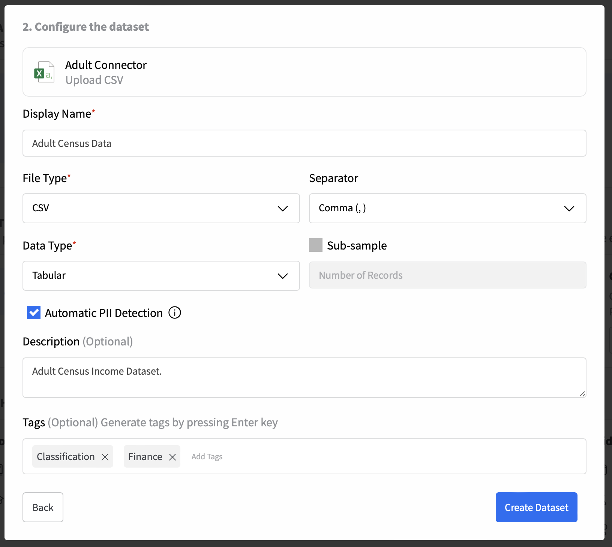
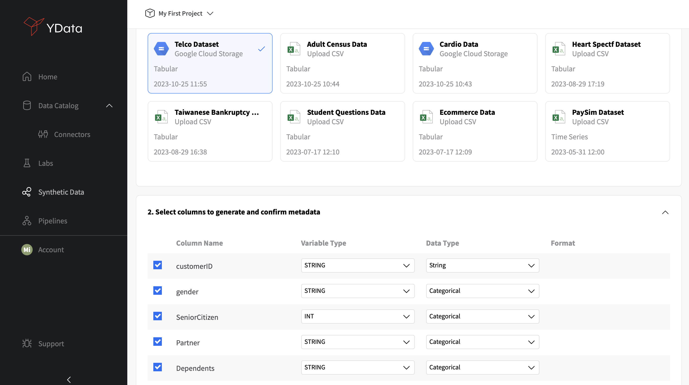
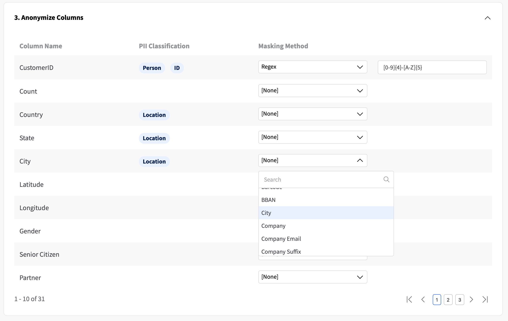
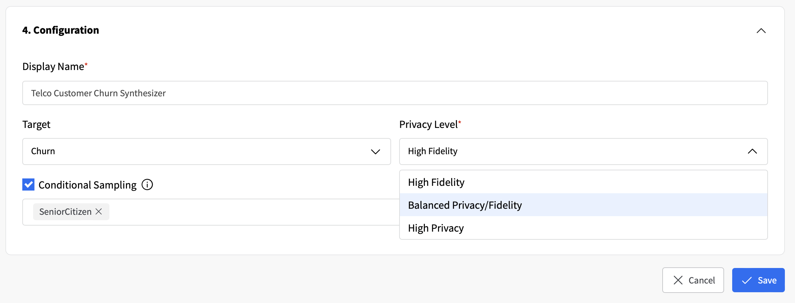
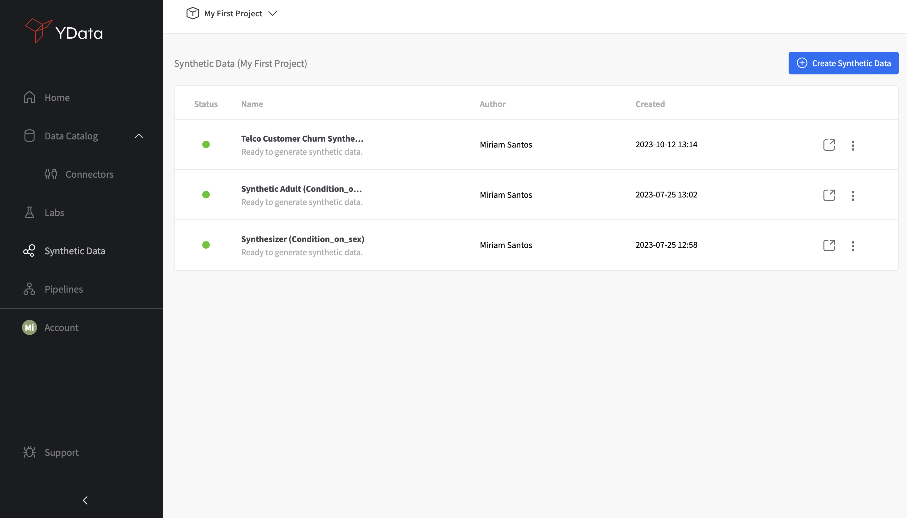
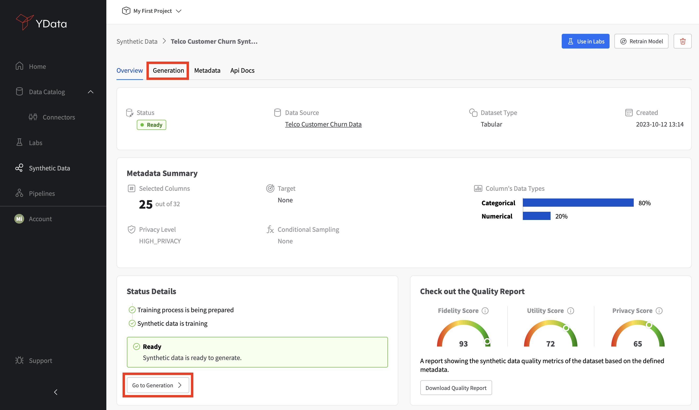
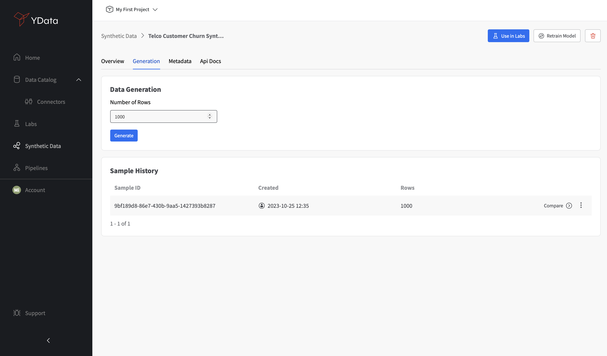
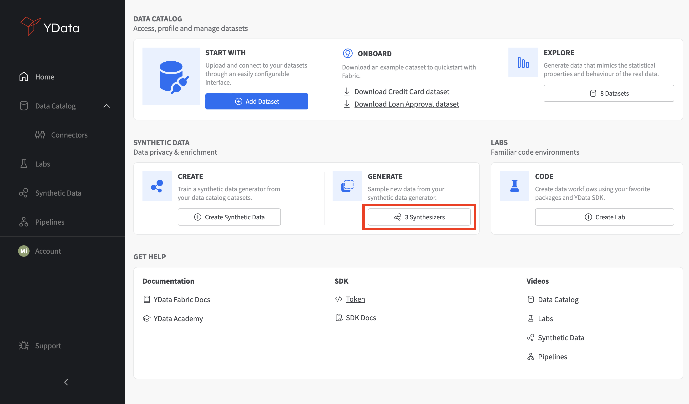

# Quickstart

## How to load your first dataset?
To load your first dataset into the Data Catalog, you can start by clicking on **"Add Dataset"** from the **Home** section.

<figure markdown>
{: style="height:550px;width:1000px"}
</figure>

Since each dataset is associated with a Connector, you'll need to create one by clicking on **"Create Connector"**.

<figure markdown>
{: style="height:500px;width:550px"}
</figure>

After choosing the desired connector, you'll need to providing the necessary details. The information required depends on the type of connector.

<figure markdown>
{: style="height:500px;width:1500px"}
</figure>

After the Connector is configured, you'll be able to add a dataset and specify its properties such as *name*, and *file* and *data types*. You can also enable the **automatic detection of potential Personal Identifiable Information (PII)** and give your dataset an insightful *description* and general *tags* that you'd like to associate with the data.

<figure markdown>
{: style="height:700px;width:900px"}
</figure>

Your recently created Connector and Dataset will be added to the Data Catalog, where you can see all your available connectors and datasets.

<figure markdown>
{: style="height:550px;width:1000px"}
</figure>

## How to generate your first synthetic data?

To generate your first synthetic data, you need to start by creating a Synthesizer by accessing the **"Synthetic Data"** section on the **Home** section and clicking on **"Create Synthetic Data"**.

<figure markdown>
{: style="height:550px;width:1000px"}
</figure>

You'll be asked to select the dataset you wish to generate synthetic data from and verify the columns you'd like to include in the synthesis process, validating their variable and data types.

<figure markdown>
{: style="height:550px;width:1000px"}
</figure>

If you wish to anonymize some columns in the data, you can do so in the **"Anonymize Columns"** section. The features that may correspond to potential PII will be identified and a suitable masking method is automatically suggested for each. However, you'll be able to select the most appropriate method by browsing the available strategies in the drop-down list.

<figure markdown>
{: style="height:550px;width:1000px"}
</figure>

Finally, you can give your Synthesizer a descriptive name and set specific configurations such as the **Target** (in case your dataset is used for supervised tasks), **Privacy Level** (which defines the trade-off between fidelity and privacy), and whether to enable **Conditional Sampling**, in case you wish to control the generation of new synthetic samples according to specific conditions (useful for data augmentation and de-bias purposes).

<figure markdown>
{: style="height:400px;width:1000px"}
</figure>  

Your Synthesizer will be created and trained and will appear in the **"Synthetic Data"** tab.

<figure markdown>
{: style="height:600px;width:1200px"}
</figure>

Once the Synthesizer has finished training, you're ready to start generating your first synthetic dataset. From the list of available Synthesizers, you can click on the one you've just created to open its details. You'll be able to check several properties of your Synthesizer and even download a PDF report with a comphreensive overview of your Synthetic Data Quality Metrics. To generate a new synthetic data sample, you'll just need to access the **"Go to Generation" or "Generation"** tabs.

<figure markdown>
{: style="height:600px;width:1200px"}
</figure>

You can then define the number of new synthetic records to generate, and your sample history will be shown below. You'll be able to **"Compare"** your synthetic data against the original data, and add the synthetic data to the Data Catalog.

<figure markdown>
{: style="height:600px;width:1200px"}
</figure>

*Note:*
If you have a previously created Synthesizer already, you can directly generate new samples from the **Home** section, by accessing the **"Generate"** tab and choosing your desired Synthesizer. The widget will directly lead you to the generation section shown above.

<figure markdown>
{: style="height:600px;width:1200px"}
</figure>
