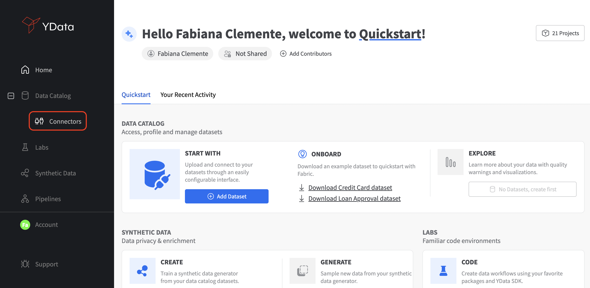
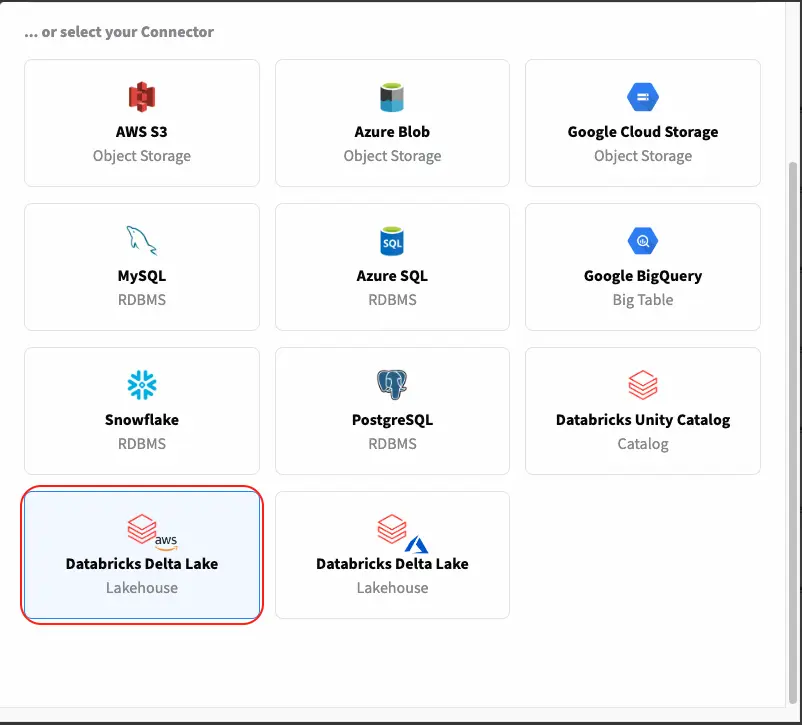
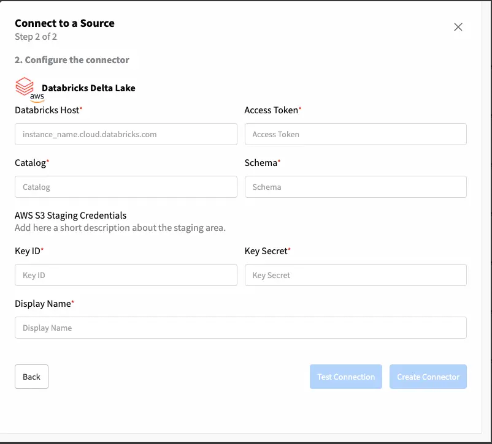
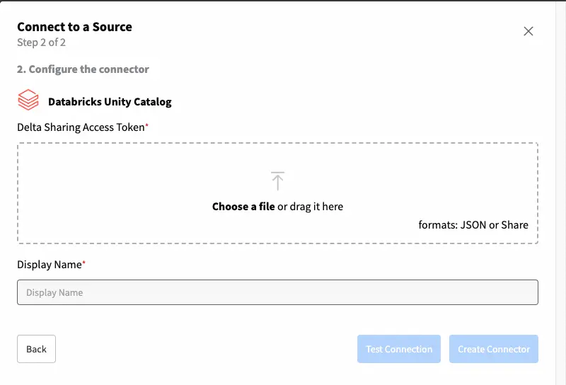

# Connectors & Catalog

^^[YData Fabric](https://ydata.ai/products/fabric)^^ provides a seamless integration with Databricks, allowing you to connect,
query, and manage your data in Databricks Unity Catalog and Delta Lake with ease. This section will guide you through the benefits,
setup, and usage of the Databricks' available connector in Fabric.

!!! note "Prerequisites"
    Before using the Fabric SDK in Databricks notebooks, ensure the following prerequisites are met:

    - Access to a Databricks workspace
    - A valid YData Fabric account and API key
    - Credentials for Databricks (tokens, Databricks host, warehouse, database, schema, etc.).

## Delta Lake

Databricks Delta Lake is an open-source storage layer that brings reliability to data lakes. Built on top of Apache Spark,
Delta Lake provides ACID (Atomicity, Consistency, Isolation, Durability) transaction guarantees,
scalable metadata handling, and unifies streaming and batch data processing.

In this tutorial it will be covered how you can leverage ^^[YData Fabric connectors](../../data_catalog/connectors/supported_connections.md)^^
to integrate with Databricks Delta Lake.

### Setting Up the Delta Lake Connector

To create a Delta Lake connector in YData Fabric Ui you need to meet the ^^[following pre-requisites](overview.md)^^.

#### Step-by-step creation through the UI
To create a connector in YData Fabric, select the *"Connectors"* page from the left side menu, as illustrated in the image below.

{: style="width:75%"}

Now, click in the *"Create Connector"* button and the following menu with the available connectors will be shown.

{: style="width:50%"}

Depending on the cloud vendor that you have your Databricks' instance deployed, select the Delta Lake connector for AWS or Azure.
After selecting the connector type *"Databricks Delta Lake"* the below menu will be shown.
This is where you can configure the connection to your Delta Lake. For that you will need the following information:

{: style="width:45%; padding-right:10px", align=left}

- **Databricks Host:** The URL of your Databricks cluster
- **Access token:** Your Databricks' user token
- **Catalog:** The name of a Catalog that you want to connect to
- **Schema:** The name of the schema that you want to connect to

Depending on the cloud selected, you will be asked for the credentials to your staging storage (**AWS S3** or **Azure Blob Storage**).
In this example we are using AWS and for that reason the below inputs refer to *AWS S3*.

- **Key ID:** The Snowflake database to connect to.
- **Key Secret:** The schema within the database.

And finally, the name for your connector:
- **Display name:** A unique name for your connector.
</br></br>
Test your connection and that's it! 🚀

You are now ready to create different **Datasources** using this connector - read the data from a table,
evaluate the quality of the data or even read a full database and generate a synthetic replica of your data!
Read more about ^^[Fabric Datasources in here](../datasources/index.md)^^.

### Use it inside the Labs

👨‍💻 ^^[Full code example and recipe can be found here](https://github.com/ydataai/academy/blob/master/1%20-%20Data%20Catalog/1.%20Connectors/Databricks%20_%20Delta%20Lake.ipynb)^^.

In case you prefer a Python interface, we also have connectors available through Fabric SDK inside the labs.
For a seamless integration between the UI and the Labs environment, Fabric offers an SDK that allows you to re-use connectors,
datasources and even synthesizers.

Start by creating your code environment through the Labs.
In case you need to get started with the Labs, ^^[check this step-by-step guide](../../get-started/create_lab.md)^^.

```python
    # Importing YData's packages
    from ydata.labs import Connectors
    # Getting a previously created Connector
    connector = Connectors.get(uid='insert-connector-id',
                               namespace='indert-namespace-id')
    print(connector)
```

#### Read from your Delta Lake
Using the Delta Lake connector it is possible to:

- Get the data from a Delta Lake table
- Get a sample from a Delta Lake table
- Get the data from a query to a Delta Lake instance

## Unity Catalog
Databricks Unity Catalog is a unified governance solution for all data and AI assets within the Databricks Lakehouse Platform.

Databricks Unity Catalog leverages the concept of [Delta Sharing](https://www.databricks.com/product/delta-sharing),
meaning this is a great way not only to ensure alignment between Catalogs but also to limit the access to data.
This means that byt leveraging the Unity Catalog connector, users can only access a set of data assets that were authorized
for a given Share.

### Step-by-step creation through the UI

:fontawesome-brands-youtube:{ .youtube } <a href="https://www.youtube.com/watch?v=_12AfMB8hiQ&t=2s"><u>How to create a connector to Databricks Unity Catalog in Fabric?</u></a>

The process to create a new connector is similar to what we have covered before to create a new *Databricks Unity Catalog*
connector in YData Fabric.

After selecting the connector *"Databricks Unity Catalog"*, you will be requested to upload your Delta Sharing token as
depicted in the image below.

{: style="width:50%"}

Test your connection and that's it! 🚀

### Use it inside the Labs

👨‍💻 ^^[Full code example and recipe can be found here](https://github.com/ydataai/academy/blob/master/1%20-%20Data%20Catalog/1.%20Connectors/Databricks%20_%20Unity%20Catalog.ipynb)^^.

In case you prefer a Python interface, we also have connectors available through Fabric inside the labs.
Start by creating your code environment through the Labs. In case you need to get started with the Labs, ^^[check this step-by-step guide](../../get-started/create_lab.md)^^.

#### Navigate your Delta Share
With your connector created you are now able to explore the schemas and tables available in a Delta share.

```python title="List available shares"
    #List the available shares for the provided authentication
    connector.list_shares()
```

```python title="List available schemas"
    #List the available schemas for a given share
    connector.list_schemas(share_name='teste')
```

```python title="List available tables"
    #List the available tables for a given schema in a share
    connector.list_tables(schema_name='berka',
                           share_name='teste')

    #List all the tables regardless of share and schema
    connector.list_all_tables()
```

#### Read from your Delta Share
Using the Delta Lake connector it is possible to:

- Get the data from a Delta Lake table
- Get a sample from a Delta Lake table

```python title="Read the data from a table"
    #This method reads all the data records in the table
    table = connector.read_table(table_name='insert-table-name',
                                 schema_name='insert-schema-name',
                                 share_name='insert-share-name')
    print(table)
```

```python title="Read a data sample from a table"
    #This method reads all the data records in the table
    table = connector.read_table(table_name='insert-table-name',
                                 schema_name='insert-schema-name',
                                 share_name='insert-share-name',
                                 sample_size=100)
    print(table)
```

I hope you enjoyed this quick tutorial on seamlessly integrating Databricks with your data preparation workflows. 🚀
