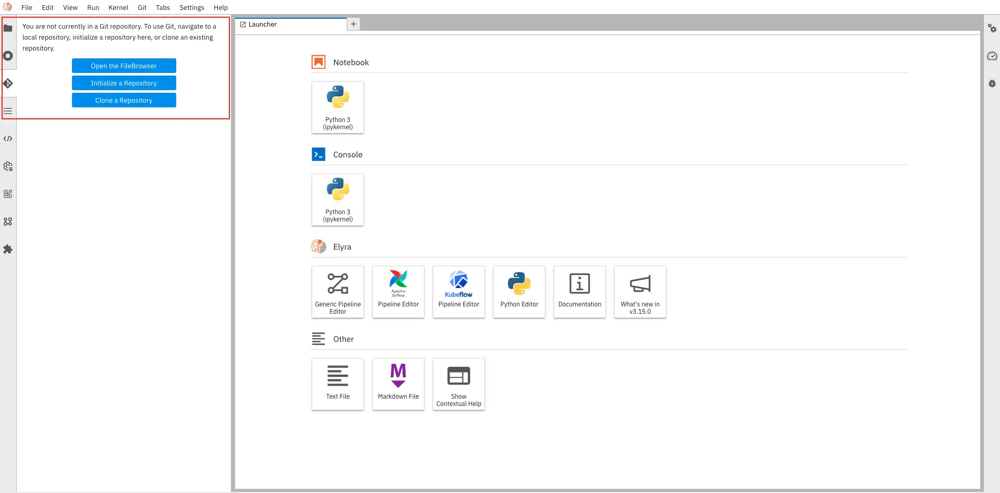
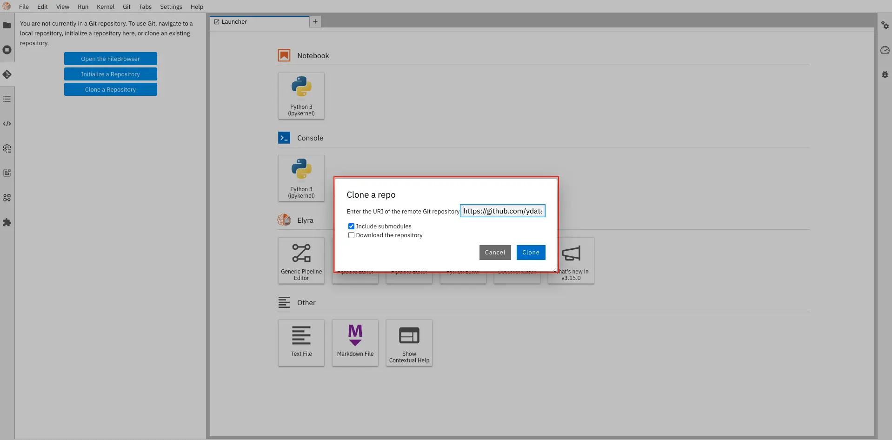
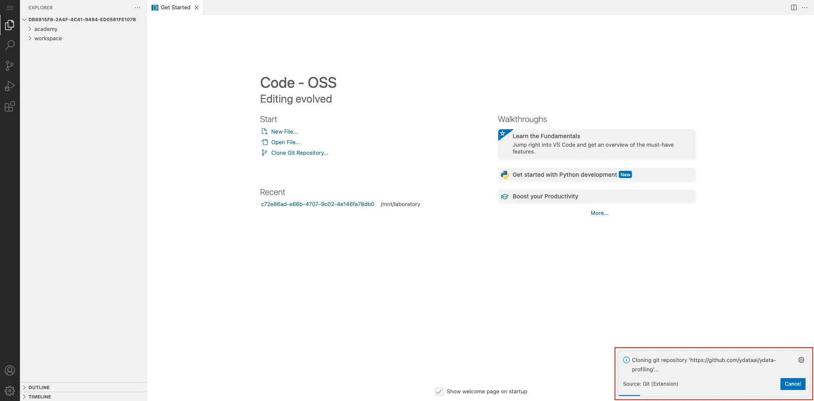

# Overview

Labs exist for Data practitioners to tackle more complex use cases through a familiar environment supercharged with infrastructure,
integration with other Fabric modules and access to advanced synthesis and profiling technology via a familiar python interface.

It is the preferred environment for Data practitioners to express their domain expertise with all the required tools,
technology and computational power at their fingertips. It is thus the natural continuation of the data understanding works which
started in Data Sources.

## Supported IDE's and images

### IDEs
YData Fabric supports integration with various Integrated Development Environments (IDEs) to enhance productivity and streamline workflows.
The supported IDEs include:

- **Visual Studio Code (VS Code):** A highly versatile and widely-used code editor that offers robust support for numerous programming languages
and frameworks. Its integration with Git and extensions like GitLens makes it ideal for version control and collaborative development.
- **Jupyter Lab:** An interactive development environment that allows for notebook-based data science and machine learning workflows.
It supports seamless Git integration through extensions and offers a user-friendly interface for managing code, data, and visualizations.
- **H2O Flow:** A web-based interface specifically designed for machine learning and data analysis with the H2O platform.
It provides a flow-based, interactive environment for building and deploying machine learning models.

### Labs images
In the Labs environment, users have access to the following default images, tailored to different computational needs:

#### Python
All the below images support Python as the programming language. Current Python version is x

- **YData CPU:** Optimized for general-purpose computing and data analysis tasks that do not require GPU acceleration. This image includes access
to YData Fabric unique capabilities for data processing (profiling, constraints engine, synthetic data generation, etc).
- **YData GPU:** Designed for tasks that benefit from GPU acceleration, providing enhanced performance for large-scale data processing and machine learning
operations. Also includes access to YData Fabric unique capabilities for data processing.
- **YData GPU TensorFlow:** Specifically configured for TensorFlow-based machine learning and deep learning applications, leveraging GPU capabilities
to accelerate training and inference processes. These images ensure that users have the necessary resources and configurations to efficiently
conduct their data science and machine learning projects within the Labs environment.
- **YData GPU Torch:** Specifically configured for Torch-based machine learning and deep learning applications, leveraging GPU capabilities
to accelerate training and inference processes. These images ensure that users have the necessary resources and configurations to efficiently
conduct their data science and machine learning projects within the Labs environment.

#### R
An ^^[image for R](https://www.r-project.org/about.html#:~:text=Introduction%20to%20R,by%20John%20Chambers%20and%20colleagues.)^^, that allows you
to leverage the latest version of the language as well as the most user libraries.

## Existing Labs

Existing Labs appear in the *Labs* pane of the web application. Besides information about its settings and status, three buttons exist:

- **Open:** Open the Lab’s IDE in a new browser tab
- **Pause:** Pause the Lab. When resumed, all data will be available.
- **Delete:** Lab will be deleted. Data not saved in the workspace’s shared folder (see below) will be deleted.

The details list of a Lab, with the status and its main actions.

The Status column indicates the Labs’ status. A Lab can have 4 statuses:

- 🟢 Lab is running
- 🟡 Lab is being created (hardware is being provisioned) or is either pausing or starting
- 🔴 Lab was shutdown due to an error. A common error is the Lab going out-of-memory. Additional details are offered in the web application.
- ⚫ Lab is paused

## Git integration
Integrating Git with Jupyter Notebooks and Visual Studio Code (VS Code) streamlines version control and collaborative workflows
for data developers. This integration allows you to track changes, manage project versions, and collaborate effectively within familiar interfaces.

### Jupyter Lab

Inside of Labs that use Jupyter Lab as IDE, you will find the ^^[*jupyterlab-git*](https://github.com/jupyterlab/jupyterlab-git)^^
extension installed in the environment.

To create or clone a new repository you need to perform the following steps:

| Select Jupyter Lab Git extension                               | Cloning a repository to your local env               |
|----------------------------------------------------------------|------------------------------------------------------|
|  |  |

For more complex actions like forking and merging branches, see the gif below:
{: style="width:80%"}

### Visual Code (VS Code)

To clone or create a new git repository you can click in *"Clone Git Repository..."* and paste it in the text box in the top center area of screen
as depicted in the image below.

| Clone Git repository                                                           | Cloning a repository to your local env                       |
|--------------------------------------------------------------------------------|--------------------------------------------------------------|
|  |  |

## Building Pipelines
Building data pipelines and breaking them down into modular components can be challenging.
For instance, a typical machine learning or deep learning pipeline starts with a series of preprocessing steps,
followed by experimentation and optimization, and finally deployment.
Each of these stages presents unique challenges within the development lifecycle.

Fabric Jupyter Labs simplifies this process by incorporating Elyra as the Pipeline Visual Editor.
The visual editor enables users to build data pipelines from notebooks, Python scripts, and R scripts, making it easier to convert multiple notebooks
or script files into batch jobs or workflows.

Currently, these pipelines can be executed either locally in JupyterLab or on Kubeflow Pipelines, offering flexibility and scalability
for various project needs. ^^[Read more about pipelines.](../pipelines/index.md)^^
