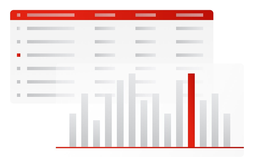
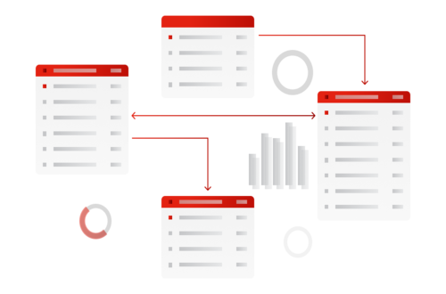

The *Fabric SDK* is an ecosystem of methods that allows users to, through a python interface, adopt data development focused on improving the quality of the data.
The solution includes a set of integrated components for data ingestion, standardized data quality evaluation and data improvement, such as *synthetic data generation*, allowing an iterative improvement of the datasets used in high-impact business applications.

!!! note "YData Fabric SDK for improved data quality everywhere!"

    To start using create a Fabric community account at ^^[ydata.ai/register](https://ydata.ai/ydata-fabric-free-trial)^^

## Benefits

Fabric SDK interface enables the ability to integrate data quality tooling with other platforms offering several beneficts in the realm of
data science development and data management:

- **Interoperability:** seamless integration with other data platform and systems like Databricks, Snowflake, etc. This ensures that all your software will work cohesively with all the elements from your data architecture.
- **Collaboration:** ease of integration with a multitude of tools and services, reducing the need to reinvent the wheel and fostering a collaborative environment for all developers (data scientists, data engineers, software developers, etc.)
- **Improved usage experience:** Fabric SDK enables a well-integrated software solution, which allows a seamless transition between different tools or platforms without facing compatibility issues.

## Current functionality

Fabric SDK is currently composed by the following main modules:

* **Datasources**
     - YData’s SDK includes several connectors for easy integration with existing data sources. It supports several storage types, like filesystems and RDBMS. Check the list of connectors.
     - SDK’s Datasources run on top of Dask, which allows it to deal with not only small workloads but also larger volumes of data.

* **Synthetic data generators**
     - Simplified interface to train a generative model and learn in a data-driven manner the behavior, the patterns and original data distribution. Optimize your model for [privacy or utility](examples/synthesize_with_privacy_control.md) use-cases.
     - From a trained synthetic data generator, you can generate synthetic samples as needed and parametrise the number of records needed.
     - [Anonymization](sdk/examples/synthesize_with_anonymization.md) and [privacy](sdk/examples/synthesize_with_privacy_control.md) preserving capabilities to ensure that synthetic datasets does not contain Personal Identifiable Information (PII) and can safely be shared!
     - [Conditional sampling](sdk/examples/synthesize_with_conditional_sampling.md) can be used to restrict the domain and values of specific features in the sampled data.

* **Synthetic data quality report**
    *Coming soon*
     - An extensive synthetic data quality report that measures 3 dimensions: privacy, utility and fidelity of the generated data. The report can be downloaded in PDF format for ease of sharing and compliance purposes or as a JSON to enable the integration in data flows.

* **Profiling**
    *Coming soon*
    - A set of metrics and algorithms summarizes datasets quality in three main dimensions: warnings, univariate analysis and a multivariate perspective.

## Supported data formats

=== "Tabular"
    { align=right }
    The **RegularSynthesizer** is perfect to synthesize high-dimensional data, that is time-indepentent with high quality results.

=== "Time-Series"
    { align=left }
    The **TimeSeriesSynthesizer** is perfect to synthesize both regularly and not evenly spaced time-series, from smart-sensors to stock.

=== "Transactional"
    { align=right }
    The **TimeSeriesSynthesizer** supports transactional data, known to have highly irregular time intervals between records and directional relations between entities.

    *Coming soon*

=== "Relational databases"
    { align=left }
    The **MultiTableSynthesizer** is perfect to learn how to replicate the data within a relational database schema.
