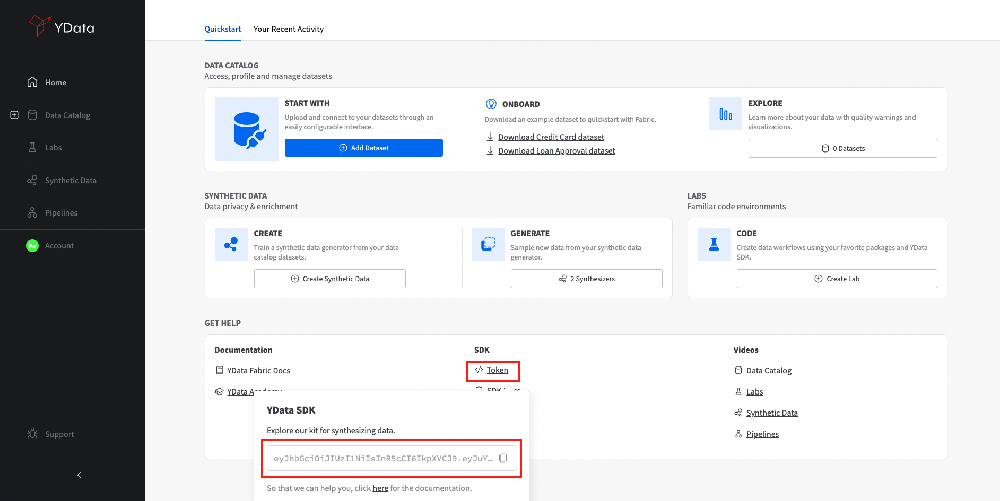

Fabric SDK is generally available through both Pypi and Conda allowing an easy process of installation. This experience allows combining Fabric SDK with other packages such as Pandas, Numpy or Scikit-Learn.

Fabric SDK is available for the public through a token-based authentication system. If you don’t have one yet, you can get your free license key during the installation process. You can check what features are available in the free version here.

##Installing the package
Fabric SDK supports python versions bigger than python 3.10, and can be installed in Windows, Linux or MacOS operating systems.

Prior to the package installation, it is recommended the creation of a virtual or conda environment:

=== "pyenv"
    ``` commandline
    pyenv virtualenv 3.10 ydatasdk
    ```

And install `ydata-fabric-sdk`

=== "pypi"
    ``` commandline
    pip install ydata-fabric-sdk
    ```

##Authentication
Once you've installed `ydata-fabric-sdk` package you will need a token to run the functionalities.
Fabric SDK uses a token based authentication system. To get access to your token, you need to have a YData account.

The token will be available [**here**](https://fabric.ydata.ai), after login:

{: style="height:450px;width:750px;align:center"}

With your account toke copied, you can set a new environment variable `YDATA_TOKEN` in the beginning of your development session.

``` python
    import os

    os.setenv['YDATA_TOKEN'] = '{add-your-token}'
```

Once you have set your token, you are good to go to start exploring the incredible world of data-centric AI and smart synthetic data generation!

Check out our [quickstart](quickstart.md) guide!
